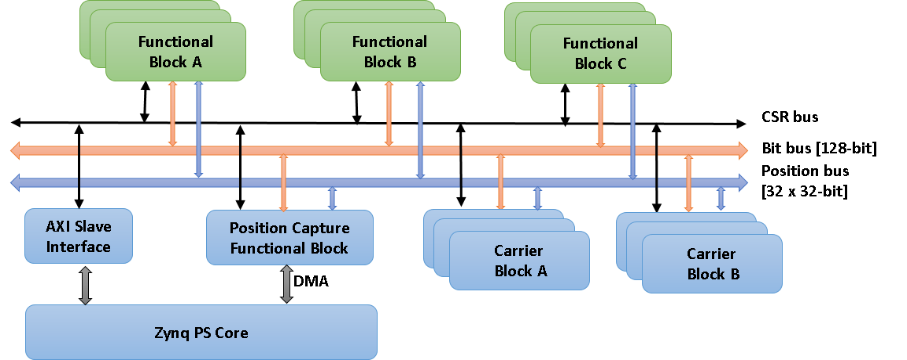

PandABlocks-FPGA
================

PandABlocks-FPGA contains the firmware that runs on the FPGA inside a Zynq
module that is the heart of a `pandablocks_device_` like `pandabox_`.

What can PandABlocks do?
------------------------

PandABlocks is a framework enabling a number of functional `block_` instances to
be written and loaded to an FPGA, with their parameters (including their
connections to other Blocks) changed at runtime. It allows flexible triggering
and processing systems to be created, by users who are unfamiliar with writing
FPGA firmware.

How is the documentation structured?
------------------------------------

The documentation is structured into a series of `tutorials_doc` and some
general `reference_doc` documentation. End users and developers need different
documentation, so links for various categories of user are listed below:

Using an existing PandABlocks device
~~~~~~~~~~~~~~~~~~~~~~~~~~~~~~~~~~~~

Work through the `tutorials_doc`.

Generating a new set of Blocks for a PandABlocks device
~~~~~~~~~~~~~~~~~~~~~~~~~~~~~~~~~~~~~~~~~~~~~~~~~~~~~~~

Read `blocks_doc` to find out what already exists, then read
`app_reference` to see how to make an `app_` of these Blocks that can be loaded
to a PandABlocks device.

Extending the functionality of a PandABlocks device
~~~~~~~~~~~~~~~~~~~~~~~~~~~~~~~~~~~~~~~~~~~~~~~~~~~

Read `blocks_doc` to see if you need to create a new Block or add to
an existing one. Read `block_reference` to find out how to specify the
interface to a Block, VHDL entity, timing tests and docs.

Working on the core autogeneration framework
~~~~~~~~~~~~~~~~~~~~~~~~~~~~~~~~~~~~~~~~~~~~

Read `block_reference` to find out how the process works, then
`framework_reference` for more details on specific parts of the autogeneration
framework