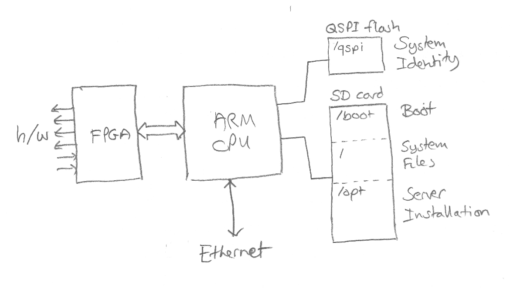
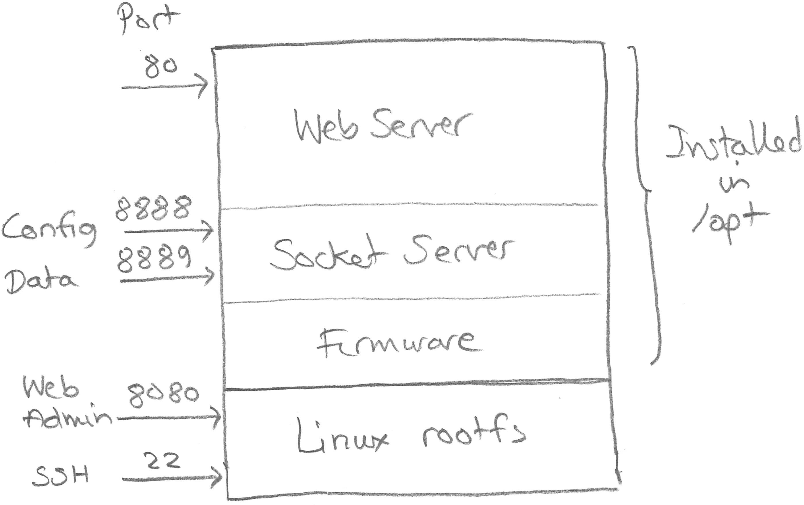
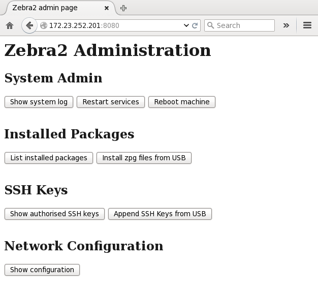

.. include:: <s5defs.txt>

.. |emdash| unicode:: U+02014 .. EM DASH
.. |bullet| unicode:: U+02022

============================
Introduction to PandA System
============================

:Author: Michael Abbott
:Date: 3rd May 2016

Review of Presentation
======================

* Overview of PandA system
* Installing and configuring PandA base system

    .. class:: small

        We'll work through a system install

* Modifying system configuration
* Installing software and firmware with ``zpkg``

PandA System Overview (Hardware)
================================

PandA System Overview (Software)
================================

PandA System Architecture
=========================

ARM processor and FPGA are tightly coupled.

Linux running on ARM processor, manages the following peripherals:

* QSPI flash contains persistent configuration

    .. class:: small

        Mounted as ``/qspi``.

* SD card contains rest of Linux file system

    .. class:: small

        Mounted as ``/boot``, ``/opt``, and ``/``.

* Network interface to system
* Programs FPGA, manages software interface

Linux System Mount Points
=========================

``/``
    The system partition occupies 500MB of SD card and contains the system
    files.  These files cannot normally be overwritten.

``/boot``
    This partition can be shared with Windows (by removing the SD card) and
    contains the system initialisation files.  This partition is 128MB.

``/opt``
    This partition occupies the remainder of the SD card and all other software
    and files are stored here.

``/qspi``
    This contains a number of persistent files.

``/mnt/sda1``
    USB drives are automatically mounted under ``/mnt``.

Files in ``/boot``
==================

``boot.bin``, ``devicetree.dtb``, ``uEnv.txt``, ``uImage``, ``uinitramfs``
    These are all required as part of the normal system boot process.  Leave
    these files alone!

``imagefile.cpio.gz``
    If present this file will be used to install or replace the system
    partition.  User files under ``/opt`` are undisturbed.  This file will be
    deleted after successful installation.

``config.txt``
    This file contains network configuration settings.

``authorized_keys``
    This file can be present to allow controlled SSH access to PandA.

``MAC``
    This can be used to set the MAC address during initial install.

Please do not add any other files to this partition.

``/boot`` Files Summary
=======================

+-----------------------+----------------------------------------------------+-+
| ``boot.bin``,         | Files required for booting, do not disturb!        | |
| ``devicetree.dtb``,   |                                                    | |
| ``uEnv.txt``,         |                                                    | |
| ``uImage``,           |                                                    | |
| ``uinitramfs``        |                                                    | |
+-----------------------+----------------------------------------------------+-+
| ``imagefile.cpio.gz`` | Replaces system partition.                         |1|
+-----------------------+----------------------------------------------------+-+
| ``MAC``               | Sets MAC address during initial install.           |1|
+-----------------------+----------------------------------------------------+-+
| ``config.txt``        | Network configuration settings.                    |2|
+-----------------------+----------------------------------------------------+-+
| ``authorized_keys``   | Authorised SSH access.                             |2|
+-----------------------+----------------------------------------------------+-+

Notes:

1.  Deleted after installation.
2.  Can be updated after installation via administration interface.

Files in ``/qspi``
==================

The on-board QSPI flash contains persistent files that are used to configure the
system identity.

``MAC``
    This must contain a valid MAC address for the Gigabit Ethernet device.

``dropbear_dss_host_key``, ``dropbear_rsa_host_key``
    Server identity used by SSH to guard against server identity changes.

``id_dropbear``, ``id_dropbear.pub``, ``known_hosts``
    SSH login keys for local root user, and login history, defined to help with
    software development.

``passwd``, ``passwd-``, ``shadow``, ``shadow-``
    Root password files.

Access to PandA and Security
============================

There are a variety of ways of administering a PandA system.

* Root login via serial console.  The default password is currently hard-wired
  to ``PandA``.

    .. class:: small

        I'm inclined to allow this to be overridden in the SD card install.

* SSH login via authorised keys.  Either add ``authorized_keys`` file to SD card
  or add from USB key via administration page.

* Web administration through port 8080.

PandA Administration
====================

The web administration page is available on port 8080, and provides the
following functions:

System administration:
    View system logs, restart installed services, and restart machine

Package management:
    Install, list, and delete installed packages.

Access control:
    Manage SSH keys for login access.

Network configuration:
    Review and update network configuration.

Administration Page
===================

Installing PandA
================

.. class:: incremental

The following procedure should become part of the manufacturing process.

Preparing SD for Install
========================

To install a fresh PandA system:

1.  Obtain a formatted empty SD card.  A minimum size of 2GB is recommended.
2.  Place the following files on the SD card (from rootfs build)::

        boot.bin    devicetree.dtb     uEnv.txt  uinitramfs
        config.txt  imagefile.cpio.gz  uImage

3.  Allocate MAC address to target system.  These need to be purchased in
    blocks.
4.  (Optionally) Write MAC address into a file named ``MAC`` on the SD card.

Panda System First Boot
=======================

It is wise to boot PandA for the first time with an connected serial console,
particularly if the MAC file has not been written.  If no MAC file has been
specified then on boot the serial console will prompt for a MAC address to be
specified::

    ------------------------------------
    Enter MAC address:

The SD card will then be repartitioned, the content of ``imagefile.cpio.gz``
will be installed and this file is deleted.

The installation process takes a couple of minutes or so, depending somewhat on
the speed of the SD card.

The serial port parameters are 115200n8.

Network Configuration
=====================

The network configuration is loaded from the following settings in
``/boot/config.txt``:

=============== ================================================================
``ADDRESS``     Fixed IP address
``NETMASK``     Netmask for fixed IP
``GATEWAY``     Routing gateway
``DNS``         List of name servers for lookup
``DNS_SEARCH``  Local domain name
``NTP``         List of NTP servers, defaults to ``pool.ntp.org`` servers.
``HOSTNAME``    Machine name
=============== ================================================================

* If ``ADDRESS`` and ``NETMASK`` are not both set then DHCP is attempted, and
  the remaining settings are also optional.
* The PandA server does not use DNS for normal operation.

Default Network Configuration
=============================

During startup the network will be configured as follows:

* If ``ADDRESS`` and ``NETMASK`` are set then a static IP will be assigned, and
  the remaining keys should also be set.

* Otherwise DHCP will be attempted.  If successful this will assign the IP
  address, gateway and DNS settings, and may assign hostname.

* If DCHP fails then "ZeroConf" is attempted.  If this also fails then PandA
  will not be reachable on the network.

Note that in the default configuration PandA will attempt to contact NTP servers
at ``0.pool.ntp.org`` etc.

Network Configuration Override
==============================

If a static IP address needs to be set this can be configured after installation
via the following override mechanism.

If a USB drive is plugged into PandA while it is booting, and if the drive
contains this file:

    ``panda-config.txt``

then this file will be used for network configuration instead of
``/boot/config.txt``.

Once PandA has booted, use the administration web page to replace ``config.txt``
with this file.

Installing Software
===================

System Software vs Application Software
=======================================

So far we have installed "system" software.  This will change very rarely,
provides core system functionality, and nothing for PandA applications.

System software is installed in the root partition and can only be changed by
placing a new ``imagefile.cpio.gz`` file in ``/boot`` and rebooting.

Application software will be installed under ``/opt`` using Z-Packages.

Zebra Packages (zpkg)
=====================

zpkg files will be used for managing all application software.  A zpkg is
defined by the following:

* The name of a zpkg file must be of the form *package*\ ``@``\ *version*\
  ``.zpg``, where *package* is the package name and *version* identifies the
  package version.

* A zpkg file is simply a gzipped tar file containing files to be installed
  under ``/opt``.

* A startup script, if required, must be present in the zpkg under
  ``etc/init.d`` and linked from ``etc/rc.d``.

Example zpgk
============

Example package contents for PandA server::

    root@panda:~# tar tzf panda-server@0.1-7-g1633529.zpg
    bin/
    bin/panda_server
    etc/
    etc/init.d/
    etc/init.d/panda-server
    etc/rc.d/
    etc/rc.d/S200panda-server
    etc/rc.d/K200panda-server
    share/
    share/panda/
    share/panda/panda.ko
    state/

Installing zpkg Files
=====================

There are two ways to maintain installed software:

1.  The simplest is via the Administration web page:

    * First place the ``.zpg`` files to install on a USB stick.
    * Insert USB stick into PandA
    * Select "Install zpg files from USB" from admin page
    * Navigate to appropriate location and select package(s) to install
    * Click on "Install Selected"

2.  Alternatively files can be copied directly to PandA and installed via a
    script, for example::

        scp panda-fpga@version.zpg root@panda:/tmp
        ssh root@panda zpkg install /tmp/panda-fpga@version.zpg

``zpkg`` Command
================

``zpkg list``
    Lists all installed packages

``zpkg install package ...``
    Installs or replaces named packages

``zpkg remove package ...``
    Removes named packages

``zpkg show package ...``
    Shows files in named packages

``zpkg verify package ...``
    Verifies files in named packages

``zpkg help``
    Show this list of options
