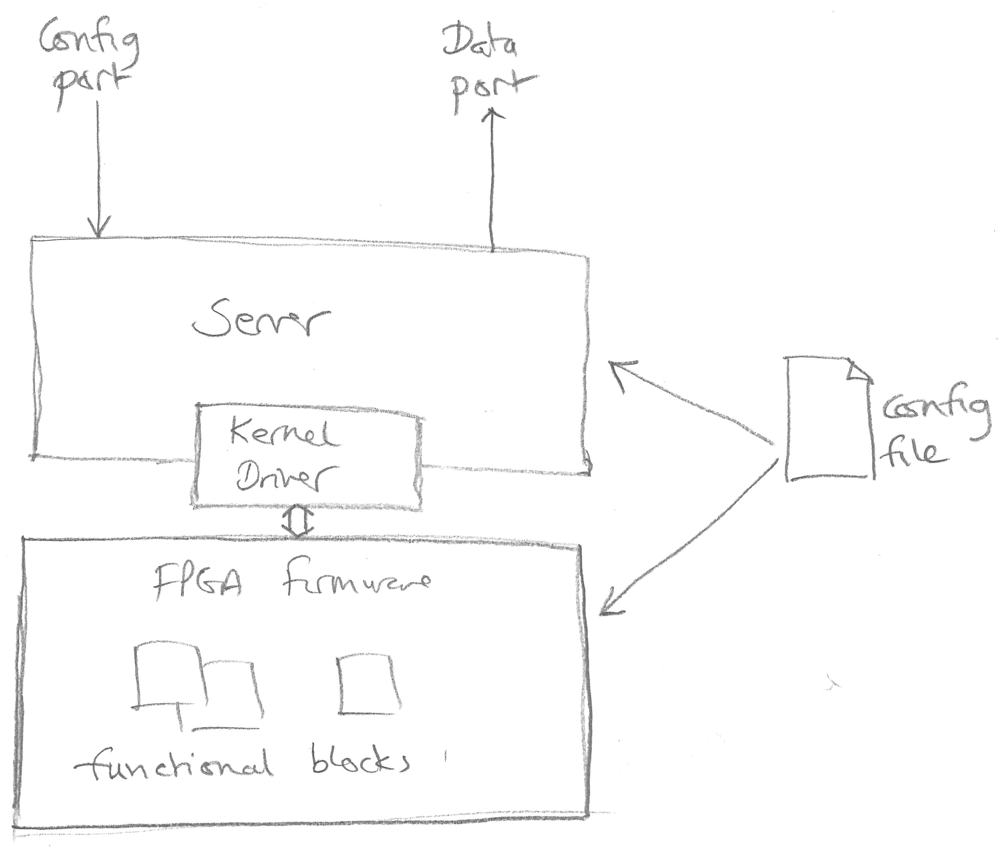

.. include:: <s5defs.txt>

.. |emdash| unicode:: U+02014 .. EM DASH
.. |bullet| unicode:: U+02022

========================
Overview of PandA Server
========================

:Author: Michael Abbott
:Date: 3rd May 2016

Architecture Overview
=====================

PandA Configuration File
========================

The PandA configuration file defines all the functional blocks and how they are
accessed.  This is used by the Socket Server and the FPGA build process to
define the interface to each functional block.

There are three configuration files:

=============== ================================================================
``config``      Defines the name and number of each functional block, lists the
                fields available in each block, and defines the behaviour of
                each field.
``registers``   Defines register assignments for each functional block and
                field.
``description`` Defines a one line description for each functional block
                and field.
=============== ================================================================

Example of ``config`` File
==========================

::

    TTLIN[6]
        TERM            param       enum 2
            0   High-Z
            1   50-Ohm
        VAL             bit_out

    TTLOUT[10]
        VAL             bit_mux

    LVDSIN[2]
        VAL             bit_out

    LVDSOUT[2]
        VAL             bit_mux

    LUT[8]
        FUNC            param       lut
        INPA            bit_mux
        INPB            bit_mux
        INPC            bit_mux
        INPD            bit_mux
        INPE            bit_mux
        OUT             bit_out

    SRGATE[4]
        SET_EDGE        param       enum 2
            0   Falling
            1   Rising
        RST_EDGE        param       enum 2
            0   Falling
            1   Rising
        FORCE_SET       write       action
        FORCE_RST       write       action
        SET             bit_mux
        RST             bit_mux
        OUT             bit_out

Understanding ``config`` File
=============================

::

    TTLIN[6]
        TERM            param       enum 2
            0   High-Z
            1   50-Ohm
        VAL             bit_out

These entries tell us:

* There are 6 ``TTLIN`` functional blocks, each with ``TERM`` and ``VAL``
  fields.

* The ``TERM`` field is a writeable parameter (``param``).

* The value written to ``TERM`` can be one of two strings (``enum 2``) with the
  strings and corresponding register setting listed.

* The ``VAL`` field contributes a bit to the internal bit bus (``bit_out``).

Example ``register`` File
=========================

::

    TTLIN       3
        TERM            slow 0
        VAL             2 3 4 5 6 7

    TTLOUT      4
        VAL             0 1

    LVDSIN      5
        VAL             8 9

    LVDSOUT     6
        VAL             0 1

    LUT         7
        FUNC            5
        INPA            0 6
        INPB            1 7
        INPC            2 8
        INPD            3 9
        INPE            4 10
        OUT             10 11 12 13 14 15 16 17

    SRGATE      8
        SET_EDGE        2
        RST_EDGE        3
        FORCE_SET       4
        FORCE_RST       5
        SET             0 6
        RST             1 7
        OUT             18 19 20 21

Understanding ``register`` File
===============================

::

    TTLIN       3
        TERM            slow 0
        VAL             2 3 4 5 6 7

These entries tell us:

* ``TTLIN`` is functional block number 3.  This determines which register block
  is used to control it.

* ``TERM`` is programmed through register 0 of the functional block, and needs
  to use the special ``slow`` API for this communication.

* The 6 ``TTLIN`` blocks contribute their ``VAL`` outputs to the specified bits
  on the internal bit bus (bits 2 to 7 respectively).

Accessing Configuration via Server
==================================

All of the relevant information in the configuration files can be read through
the socket server interface.  For example, to interrogate list of available
blocks::

    < *BLOCKS?
    > !TTLIN 6
    > !OUTENC 4
    > !PCAP 1
    > ...

The fields and field types can be interrogated for each block::

    < TTLIN.*?
    > !VAL 1 bit_out
    > !TERM 0 param enum
    > .

Understanding Field Descriptions
================================

Configurable fields.

======================= ========================================================
Field type              Description
======================= ========================================================
``param`` *subtype*     Configurable parameter.  The *subtype* determines the
                        precise behaviour and the available attributes.
``read`` *subtype*      A read only hardware field, used for monitoring status.
                        Again, *subtype* determines available attributes.
``write`` *subtype*     A write only field, *subtype* determines possible values
                        and attributes.
``time``                Configurable timer parameter.
``table``               Table data with special access methods.
======================= ========================================================

Understanding Field Descriptions
================================

Capturable fields.

======================= ========================================================
Field type              Description
======================= ========================================================
``bit_out``             Bit output, can be configured as bit input for
                        ``bit_mux`` fields.
``pos_out`` [*extra*]   Position output, can be configured for data capture and
                        as position input for ``pos_mux`` fields.
``ext_out`` [*extra*]   Extended output values, can be configured for data
                        capture, but not available on position bus.
``bit_mux``             Bit input with configurable delay.
``pos_mux``             Position input multiplexer selection.
======================= ========================================================
