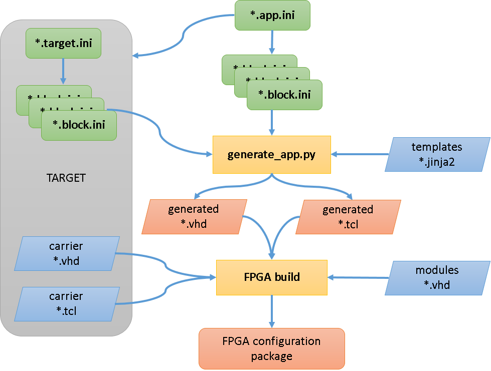

.. _block_reference:

Writing a Block
===============

If you have checked the list of `blocks_doc` and need a feature that is not
there you can extend an existing `block_` or create a new one. If the feature
fits with the behaviour of an existing Block and can be added without breaking
backwards compatibility it is preferable to add it there. If there is a new
type of behaviour it may be better to make a new one.

This page lists all of the framework features that are involved in making a
Block, finding a `module_` for it, defining the interface, writing the
simulation, writing the timing tests, documenting the behaviour, and finally
writing the logic.

Architecture
------------

An overview of the build process is shown in this diagram, the stages and
terminology are defined below:

Modules
-------

Modules are subdirectories in ``modules/`` that contain Block definitions. If
you are writing a soft Block then you will typically create a new Module for it.
If you are writing a Block with hardware connections it will live in a Module
for that hardware (e.g. for the FMC card, or for that `target_platform_`).

To create a new module, simply create a new directory in ``modules/``

.. _block_ini_reference:

Block ini
---------

The first thing that should be defined when creating a new Block is the
interface to the rest of the framework. This consists of an ini file that
contains all the information that the framework needs to integrate some VHDL
logic into the system. It lives in the Module directory and has the extension
``.block.ini``. It consists of a top level section with information
about the Block, then a section for every `field_` in the Block.

The [.] section
~~~~~~~~~~~~~~~

The first entry to the ini file describes the block as a whole. It looks like
this:

.. code-block:: ini

    [.]
    description: Short description of the Block
    entity: vhdl_entity
    type: dma or sfp or fmc
    constraints:
    ip:
    otherconst:
    extension:

The ``description`` should be a short (a few words) description that will be
visible as a Block label to users of the `pandablocks_device_` when it runs.

The ``entity`` should be the name of the VHDL entity that will be created to
hold the logic. It is typically the lowercase version of the Block name.

The ``type`` field will identify if the block is an SFP, FMC or DMA. These are
special cases and need to be handled differently. This field is automatically
set to soft for soft blocks or carrier for carrier blocks.

The ``constraints`` is used to identify the location of any xdc constraints
files, relative to the module's directory.

The ``ip`` field holds the name of any ip blocks used in the module's vhdl code.

``otherconst`` is used to locate a tcl script if the block needs any further
configuration.

If the ``extension`` field is present then the ``extensions`` directory in the
module must exist and contain a python server extension file.

[FIELD] sections
~~~~~~~~~~~~~~~~

All other sections specify the Field that will be present in the Block. They
look like this:

.. code-block:: ini

    [MYFIELD]
    type: type subtype options
    description: Short description of the Field
    extension: extension-parameter
    extension_reg:
    wstb:

The section name is used to determine the name of the Field in the resulting
Block. It should be made of upper case letters, numbers and underscores.

The ``type`` value gives information about the type_ which specifies the
purpose and connections of the Field to the system. It is passed straight
through to the field specific line in the config file for the TCP server so
should be written according to type_ documentation. Subsequent indented lines
in the config file are supplied according to the ``type`` value and are
documented in `extra_field_keys`.

The ``description`` value gives a short (single sentence) description about
what the Field does, visible as a tooltip to users.

If ``extension`` is specified then this field is configured as an extension
field.  If the ``extension_reg`` field is also specified then this field is also
a hardware register.

If a signal uses a write strobe ``wstb`` should be set to True.

.. _extra_field_keys:

Extra Field Keys
~~~~~~~~~~~~~~~~

Some field types accept extra numeric keys in the Field section to allow extra
information to be passed to the TCP server via its config file.

Enum fields would contain numeric keys to translate specific numbers into
user readable strings. Strings should be lowercase letters and numbers with
underscores and no spaces. A typical field might look like this:

.. code-block:: ini

    [ENUM_FIELD]
    type: param enum  # or read enum or write enum
    description: Short description of the Field
    0: first_value
    1: next_value
    2: another_value
    8: gappy_value

Tables will be defined here too

.. _block_simulation_reference:

Block Simulation
----------------

The Block simulation framework allows the behaviour to be specified in Python
and timing tests to be written against it without writing any VHDL. This is
beneficial as it allows the behaviour of the Block to be tied down and
documented while the logic is relatively easy to change. It also gives an
accurate simulation of the Block that can be used to simulate an entire
`pandablocks_device_`.

The first step in making a Block Simulation is to define the imports:

.. code-block:: python

    from common.python.simulations import BlockSimulation, properties_from_ini, \
        TYPE_CHECKING

    if TYPE_CHECKING:
        from typing import Dict

The ``typing`` imports allow IDEs like PyCharm to infer the types of the
variables, increasing the chance of finding bugs at edit time.

The BlockSimulation is a baseclass that our simulation should inherit from:

.. autoclass:: common.python.simulations.BlockSimulation
    :members:

Next we read the block ini file:

.. code-block:: python

    NAMES, PROPERTIES = properties_from_ini(__file__, "myblock.block.ini")

This generates two objects:

* ``NAMES``: A `collections.namedtuple` with a string attribute for every field,
  for comparing field names with.
* ``PROPERTIES``: A `property` for each Field of the Block that can be attached
  to the `BlockSimulation` class

Now we are ready to create our simulation class:

.. code-block:: python

    class MyBlockSimulation(BlockSimulation):
        INP, ANOTHER_FIELD, OUT = PROPERTIES

        def on_changes(self, ts, changes):
            """Handle field changes at a particular timestamp

            Args:
                ts (int): The timestamp the changes occurred at
                changes (Dict[str, int]): Fields that changed with their value

            Returns:
                 If the Block needs to be called back at a particular ts then return
                 that int, otherwise return None and it will be called when a field
                 next changes
            """
            # Set attributes
            super(MyBlockSimulation, self).on_changes(ts, changes)

            if NAMES.INP in changes:
                # If our input changed then set our output high
                self.OUT = 1
                # Need to be called back next clock tick to set it back
                return ts + 1
            else:
                # The next clock tick set it back low
                self.OUT = 0

This is a very simple Block, when ``INP`` changes, it outputs a 1 clock tick
pulse on ``OUT``. It checks the changes dict to see if ``INP`` is in it, and
if it is then sets ``OUT`` to 1. The framework only calls ``on_changes()``
when there are changes unless informed when the Block needs to be called next.
In this case we need to be called back the next clock tick to set ``OUT`` back
to zero, so we do this by returning ``ts + 1``. When we are called back next
clock tick then there is nothing in the changes dict, so ``OUT`` is set back
to 0 and return None so the framework won't call us back until something
changes.

.. note::

    If you need to use a field name in code, use an attribute of ``NAMES``. This
    avoids mistakes due to typos like::

        if "INPP" in changes:
            code_that_will_never_execute

    While if we use ``NAMES``::

        if NAMES.INPP in changes:  # Fails with AttributeError

Timing ini
----------

The purpose of the .timing.ini file is to provide expected data for comparison
in the testing of the modules. Data should be calculated as to how and when the
module will behave with a range of inputs.

The [.] section
~~~~~~~~~~~~~~~

The first entry to the ini file describes the timing tests as a whole. It looks
like this::

    [.]
    description: Timing tests for Block
    scope: block.ini file

[TEST] sections
~~~~~~~~~~~~~~~

The other sections will display the tests inputs and outputs. It looks like
this::

    [NAME_OF_TEST]
    1:  inputA=1, inputB=2          -> output=3
    5:  inputC=4                    -> output=7
    6:  inputD=-10                  -> output=0, Error=1

The numbers at the left indicate the timestamp at which a change occurs,
followed by a colon. Any assignments before the -> symbol indicate a change in
an input and assignments after the -> symbol indicate a change in an output.

Target ini
----------
A target.ini is written for the blocks which are specific to the target. This
ini file declares the blocks and their number similar to the app.ini file.

The [.] section
~~~~~~~~~~~~~~~
The first entry to the ini file defines information for the SFP sites for the
target::

    [.]
    sfp_sites:
    sfp_constraints:

The ``sfp_sites`` type is the number of available SFP sites on the target, and
the ``sfp_sites`` type is the name of the constraints file for each SFP site,
located in the target/const directory.

[BLOCK] sections
~~~~~~~~~~~~~~~~
The block sections are handled in the same manner as those within the app.ini
file, however the type, unless overwritten in the block.ini files for these
blocks is set to carrier, rather than soft.

Writing docs
------------

Two RST directives, how to structure

Block VHDL entity
-----------------

How to structure the VHDL entity

.. _type: :ref:`Field Type <server:fields>`

.. _TCP server: :ref:`TCP server <server:fields>`
