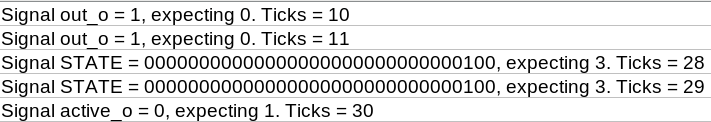
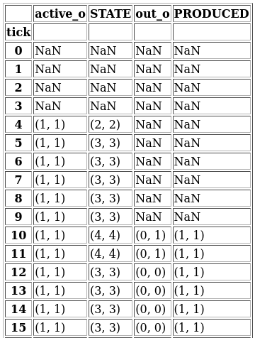
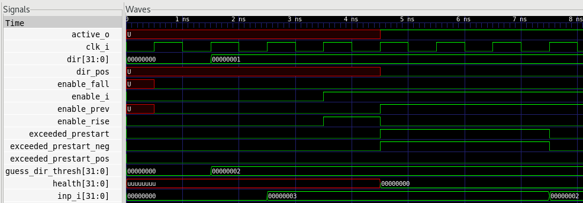
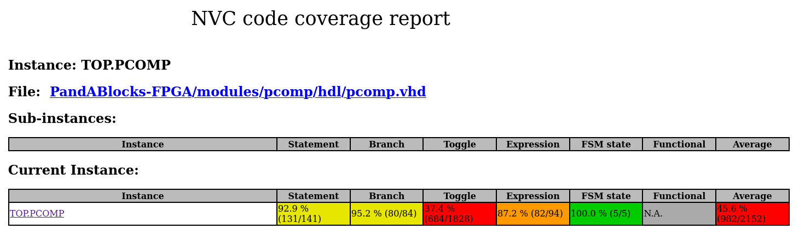

.. _cocotb_reference:

Testing with cocotb
===================

Any module with a `timing.ini` file can be tested using the **cocotb** test runner.

About cocotb
------------

**Cocotb** is an open-source Python library for simulating VHDL or Verilog
designs. It allows you to write and drive testbenches in Python, using a
simulator like **GHDL** or **NVC** under the hood.

Running the tests
-----------------

You can run the tests via the following command::

    make cocotb_tests MODULE=module1,module2,... TEST="test1,,test2,,..." SIMULATOR=nvc/ghdl

By default, all testbenches will be run, and the NVC simulator will be used.
When parsing multiple tests, a double comma must be used to seperate them as
the names of some tests contain commas.

Results
-------

A simulation build directory will be created for every module tested in a run.
This directory is called `sim_build_{module_name}`, and contains subdirectories
for each test that was run. 

.. image:: sim_build_clock.png

Timing Errors
~~~~~~~~~~~~~

If a condition fails, a timing error is recorded. A test has failed if any 
timing errors have occurred during its execution.

As well as being displayed in the terminal, any timing errors will be saved to 
a file in the subdirectory of the test where the error occurred.

A table of expected vs actual signal values is produced and can be found in the
same place, in the form of a `.csv` and `.html` file. This is collected for any
signal whos value is checked at some point during the test.

Waveforms
~~~~~~~~~

A `wave.vcd` file can be found in each tests subdirectory. This can be opened
with **GTKWave** to inspect the signal waveforms.

Coverage
~~~~~~~~
A coverage report will be generated if the NVC simulator has been used. This
be found in the coverage subdirectory of the simulation directory.

How It Works
------------

The runner utilizes a module's `timing.ini` file to create a schedule for:

- Assigning input signals.
- Checking conditions on output signals.

The runner uses Cocotb to simulate and verify the module according to this
schedule. To set up tests and initialize signals correctly, some information
about the module is needed. Most of this information can be derived from the
module's `block.ini` file. For more complex modules (e.g. those dependent on
other HDL files), some additional information might be necessary, such as:
  
- Paths to required HDL files.
- Specific signal details.
- Name of top-level entity

This extra information is provided in a `test_config.py` file located in the
module directory.

Script Arguments and Options
~~~~~~~~~~~~~~~~~~~~~~~~~~~~

The runner script can be run directly without using `make`::

   python3 common/python/cocotb_timing_test_runner.py {module} {test}

**Positional Arguments**:

   - `module`: The name of the module to test. Multiple modules can be specified, separated by commas. Use `all` to test all modules with a `timing.ini` file.
   - `test` (optional): The name of a specific test to run.

**Optional Flags**:

   - `--sim {nvc/ghdl}`: Specify the simulator (default: `nvc`). With NVC, coverage data will be collected.
   - `--skip {module1,module2,...}`: List of modules to skip during testing.
   - `--panda-build-dir {path}`: Specify the directory where autogenerated HDL files (e.g., from `make autogen`) are located. Defaults to `/build`.
   - `-c`: Save expected and actual output signal values in a `.csv` and `.html` file.

Writing Tests for New Modules
-----------------------------

To test a new module using this runner, ensure the module directory contains:

   - `{module}.block.ini`: Describes signals involved in the module.
   - `{module}.timing.ini`: Contains schedule for signal assignments and condition checks.

Add a `test_config.py` file (if needed) to include:

   - Paths to additional HDL files.
   - Any extra signal information not covered in `block.ini`.
   - Top-level entity to be tested.

Modules with `timing.ini` files are automatically identified as testable. The
module may fail tests until `block.ini` and `test_config.py` are configured
correctly. 

Modules using IP are currently unsupported.

More details
------------

Cocotb provides a Python simulator object to:

1. **Build the Simulation**: The `.build()` method runs the analysis and evaluation stages.
2. **Run the Test**: The `.test()` method starts the simulation.

**Key points**:

- The `test()` method takes a `test_module` argument to locate the test.
- Cocotb scans the test module for functions decorated with `@cocotb.test()`, which define the test logic.

In this setup:

- The test module is `cocotb_simulate_test.py`.
- The decorated function is `module_timing_test(dut)`.
- Cocotb calls this function, passing the **Design Under Test (DUT)** object, which provides access to the module's signals for assignments and condition checks.

Timing is measured by counting clock signal rising edges to synchronize
assignments and condition checks.
