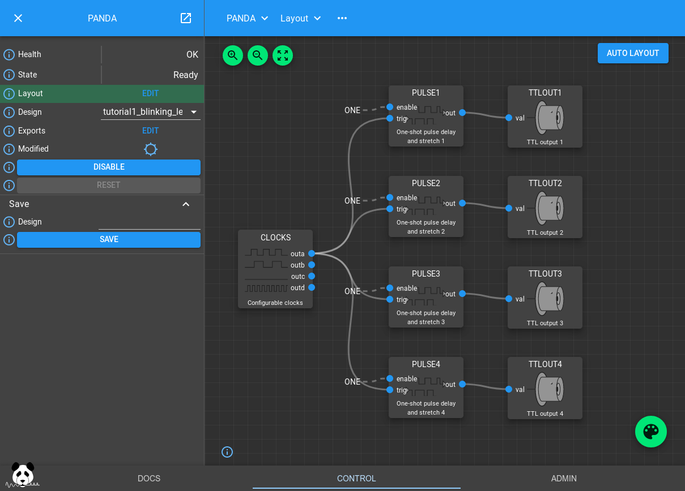
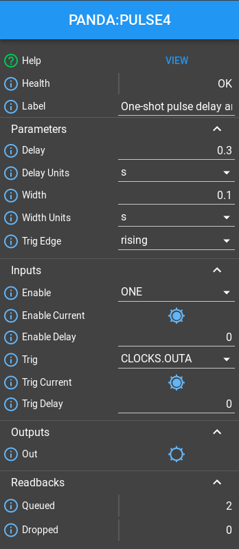

.. _blinking_leds_tutorial:

Blinking LEDs Tutorial
======================

This tutorial will introduce you to the basics of PandABlocks, how to wire
Blocks together to make different LEDs flash at different rates

Opening the GUI
---------------

Point your web browser at the ip address or hostname of the PandA and you will
be greeted with a welcome page. At the bottom of this page will be links for
Docs, Control and Admin. You can use the Control link to open the Web Control
page that we will use in these tutorials. For more information on the Web
Control, see its entry in the Docs section.

Loading the tutorial design
---------------------------

The Design dropdown box allows you to select from saved designs stored on the
PandA. Selecting an item from this list will load the saved design over the
current Block settings. You can use the Save method to save your current
design if you wish to keep it.

Select "template_tutorial1_leds" from the box and the settings and wiring of
the Blocks in the PandA will be changed to the following:

If you now look at the front panel of the PandA you should see the first 4
TTL output LEDs turn on sequentially, then turn off in the opposite order.

How the design works
--------------------

The CLOCKS Block is creating a 50% duty cycle pulse train with a period of 1s.
PULSE1..4 are taking this as an input trigger, and producing a different width
pulse with a different delay for each PULSE Block. These PULSE Blocks work as a
delay line, queuing a series of pulses up to be sent out when the delay expires.

If you click on one of them you can see its settings:

If you increase the delay beyond the 1s period you will notice that the Queued
input will increase, but the PULSE Block will still continue outputting pulses
after the desired delay. However if you increase the width beyond the pulse
period the Block will drop the pulse, reporting it via the dropped pulses field
to avoid merging them together.

You can also try clicking on the CLOCKS Block to modify the period of the input
pulse train.

You can also try wiring these outputs to different TTLOUT Blocks by clicking
the Palette icon, dragging a TTLOUT Block onto the canvas, and connecting it
up by dragging the PULSE out port to the TTLOUT val port.

The Bit Bus
-----------

All ports on the visible Blocks are blue. They represent bits, single boolean
values that can propagate through the system by connecting Blocks together.
These outputs

.. note::

    10Hz flashing update

Conclusion
----------

This tutorial has shown how to load a saved design and modify some parameters.
It has also introduced the PULSE delay block that is useful for delaying and
stretching trigger signals. It has introduced bit outputs and shown how they
can be connected to the outside world using the TTLOUT Blocks. In the next
tutorial we will read about position outputs, how they can be set and how they
can be captured.
