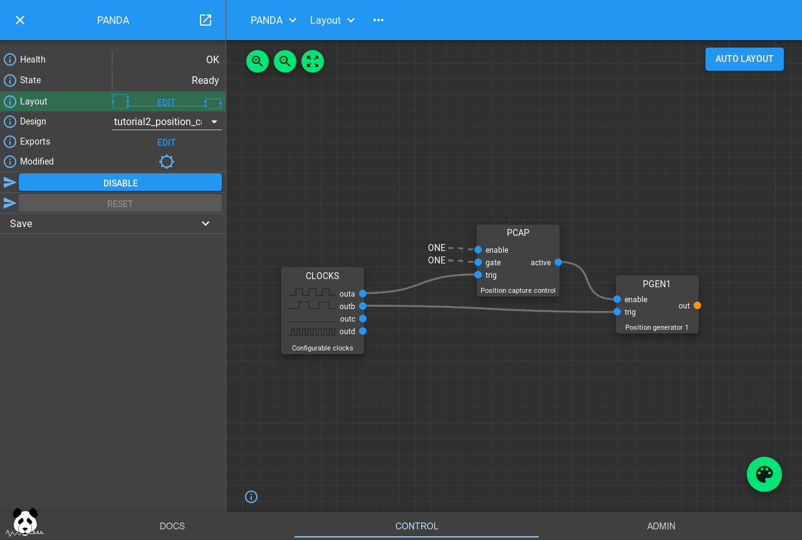
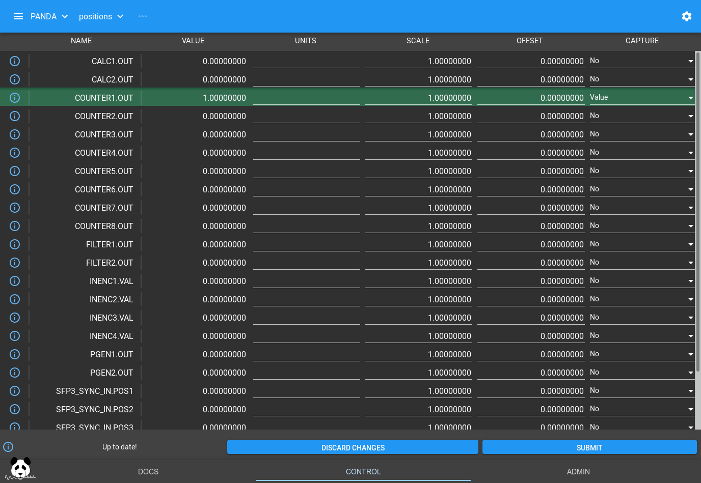

.. _position_capture_tutorial:

Position Capture Tutorial
=========================

This tutorial will introduce you to the Position Capture interface of
PandABlocks, how to provide trigger signals to control when these capture points
are taken and visualize the data.

Loading the tutorial design
---------------------------

Select "template_tutorial2_pcap" from the Design dropdown box and the settings
and wiring of the Blocks in the PandA will be changed to the following:

How the design works
--------------------

This design has two CLOCK Blocks, which are enabled as soon as the PCAP Block
becomes active. The first CLOCK triggers PCAP on its falling edge, while the
second triggers a COUNTER to increment by one on its rising edge. We start off
with both CLOCK Blocks set to a period of 1s, so each second the COUNTER will
increment by one, followed by a PCAP trigger half a second later. This is best
viewed as a timing diagram:

.. timing_plot::
   :path: docs/tutorials/tutorial2.timing.ini
   :section: Trigger Only
   :xlabel: Milliseconds

What PCAP does on that trigger is determined by the PCAP Block settings, and
the contents of the Bits and Positions tables. For Bits you can turn capture
(instantaneous at the time of trigger) on and off. For Positions, you have a
choice of:

============== =======================
Capture        Description
-------------- -----------------------
No             Don't capture
Value          Instantaneous capture at time of trigger
Diff           The difference in the value while gate was high
Sum            The sum of all the samples while gate was high
Min            The smallest value seen while gate was high
Max            The largest value seen while gate was high
Mean           The average value seen while gate was high
Min Max        Capture both Min and Max
Min Max Mean   Capture Min Max and Mean
============== =======================

There are also a handlful of other fields like the start of frame, end of frame
and trigger time that can be captured by setting fields on the PCAP Block.

We can set COUNTER1 to capture the Value at trigger by modifying the Positions
table and pressing Submit:

Now we can get a client ready to receive data. We can capture data in ASCII or
Binary format as detailed in the TCP server documentation, and TANGO and EPICS
have clients to do this. For this tutorial we will just use the ASCII format on
the commandline to check::

   $ nc <panda-ip> 8889

Here we could specify binary output and header format, but we'll just stick
with the default ASCII output (the default). Press Return again, and we will
see::

   OK

Now go back to the PandA layout and select the PCAP Block, pressing the ARM
button. The Active light will go on and data will start streaming in the
terminal window until Disarm is pressed::

   missed: 0
   process: Scaled
   format: ASCII
   fields:
    COUNTER1.OUT double Value scale: 1 offset: 0 units:

    1
    2
    3
    4
    5
   END 5 Disarmed

This tallies with the timing diagram we saw above, the instantaneous value of
COUNTER1.OUT when PCAP.TRIG went high was as captured.

We can 